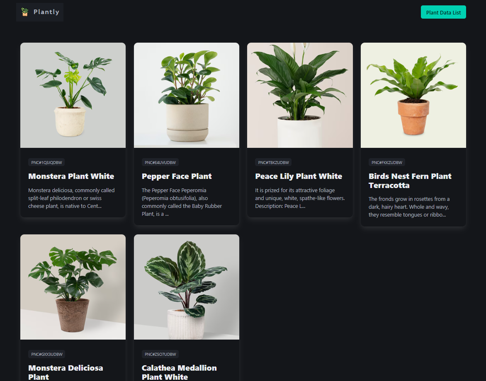

# Plantly Web

An experimental project that aims to build a working application contained in a single index.php file. This project uses PHP, Firebase Realtime Database and Bulma CSS for its pages.

## Screenshot App

## Tech Stack

